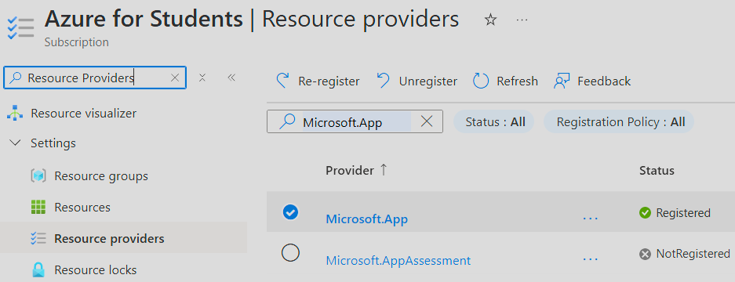
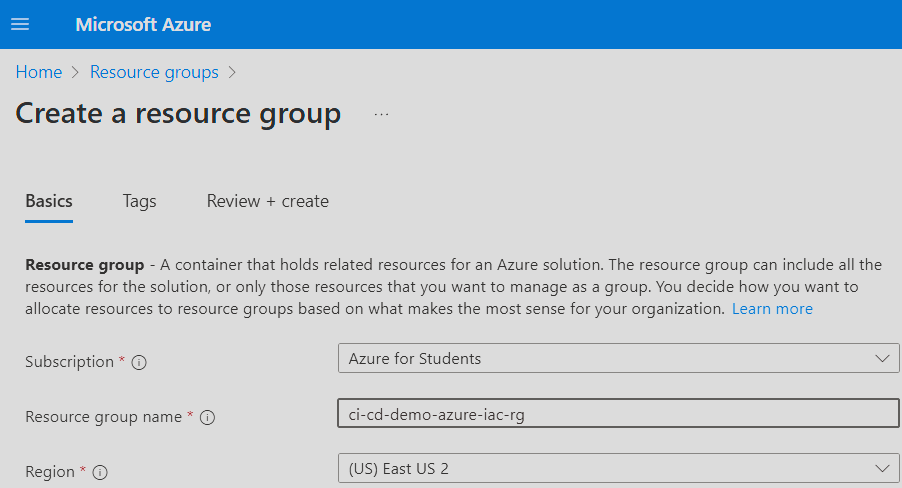
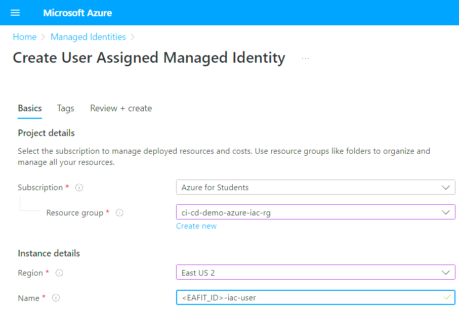
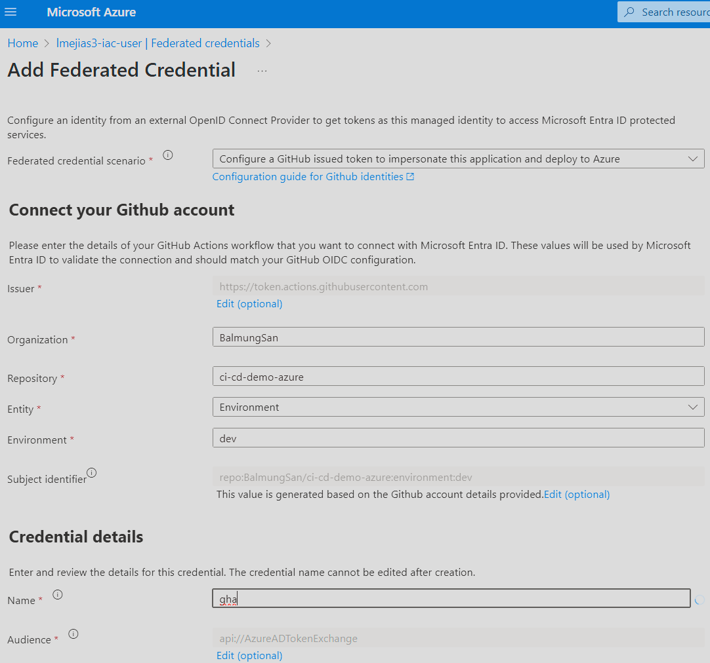
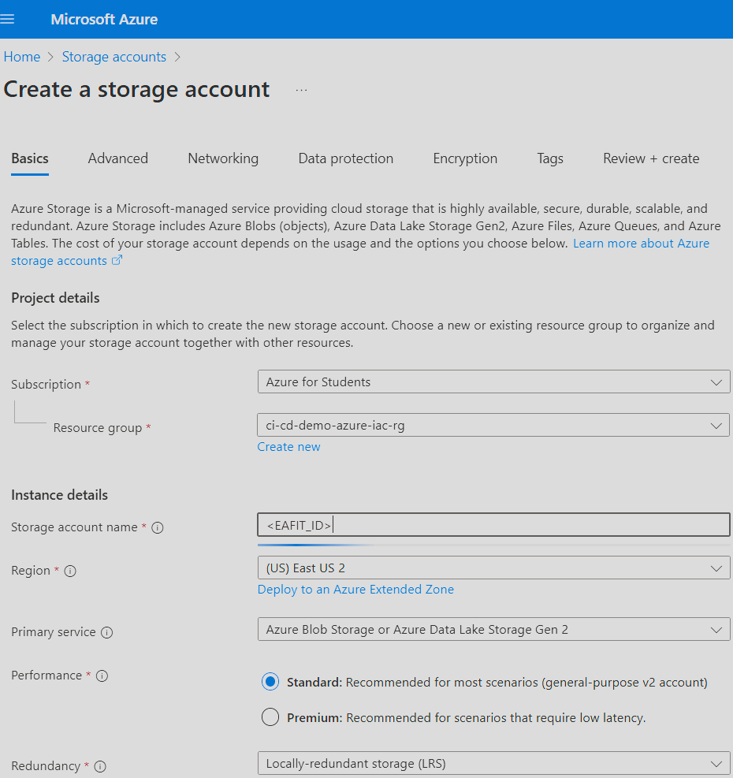
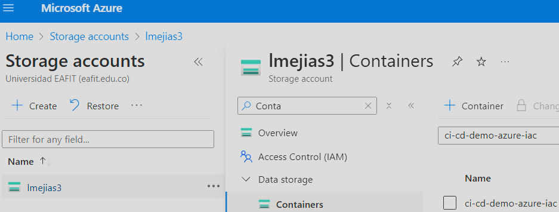
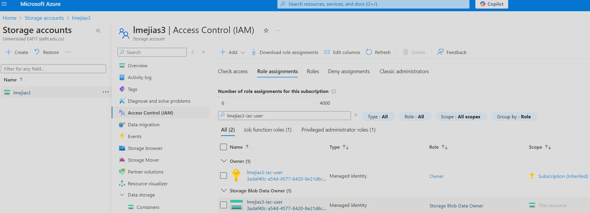

# CI / CD demo for Azure

Demo showing how to use **GitHub Actions** to configure a `CI / CD` pipeline deploying a **Dockerized** **Scala** app to **Azure** using **Terraform**.

-----

## Testing the app

You can test the application using:
* The **Swagger** web page: https://todo-service.delightfulrock-a4ca9c1b.westus3.azurecontainerapps.io/docs/index.html.
* In the console using **curl**: `curl -X GET https://todo-service.delightfulrock-a4ca9c1b.westus3.azurecontainerapps.io/list` ; or any other similar web client.
* Using the **Scala** CLI app: `sbt client/run`.
* Writing a client in any language that supports **smithy**.

-----

## Instructions

Follow these instructions to get your own version of the application up and running in **Azure**.

### Azure setup

First we are going to create and configure an **Azure** account to allow automatic deployments through **Terraform**:

1. Create an **Azure** account, ideally using your **EAFIT** student credentials: https://azure.microsoft.com/en-us/free/students

2. Inside your **Azure** account, go to the `Subscriptions` service page. Pick the `subscription` you will be using; e.g. `Azure for Students`. Then, inside the `subscription`, search for `Resource Providers`. In the `Resource Providers` list search for the one called `Microsoft.App` and `register` it.

  

3. Inside your **Azure** account, go to the `Azure Database for PostgreSQL flexible servers` service page. Try to create a new server, and then in the _create_ page, search for a `Region` _(`Location`)_ that is not restricted for your `Azure for Students` `subscription`. Take note of the one you want to use, will be using the same `Region` _(`Location`)_ for everything else. You can now exit without creating anything.

4. Go to the **Azure** `Resource Groups` service page. We are going to create a `resource-group`, for grouping all the _meta-resources_ that will be used by **Terraform**:
  * Make sure you pick the correct `subscription`.
  * For the `Name`, it can be anything; but I recommend the following: `ci-cd-demo-azure-iac-rg`.
  * For the `Region` _(`location`)_, it MUST BE the one you took note in the `3` step.

  

5. Go to the **Azure** `Managed Identities` service page. We are going to create a `user-assigned-managed-identity`, that will be used by **Terraform** for creating the resources:
  * Make sure you pick the correct `subscription`.
  * Make sure you pick the correct `resource-group`.
  * For the `Region` _(`location`)_, it MUST BE the one you took note in the `3` step.
  * For the `Name`, it can anything; but I recommend the following: `<EAFIT_ID>-iac-user`.
  > Note: `EAFIT_ID` is your **EAFIT** username; for example mine is `lmejias3`.

  

6. Then, inside the `user-assigned-managed-identity`, go to `Azure Role Assignments`. We are going to make it an `Owner` of the `subscription`, in order to allow **Terraform** to create resources:
  * For the `Scope` select `Subscription`.
  * Make sure you pick the correct `subscription`.
  * For the `Role` select `Owner`.

  

7. Finally, inside the `user-assigned-managed-identity`, go to `Federated Credentials`. We are going to allow **GitHub** to get tokens associated with this identity:
  * For the `Federated Credential Scenario` select `GitHub Actions deploying Azure resources`.
  * Fill the `Organization` and `Repository` fields with the right values for your own `fork` of this repository.
  * For the `Entity` select `Environment` and it MUST BE called `dev`.
  * For the `Name`, it can anything; but I recommend the following: `gha`.

  

8. Go to the **Azure** `Storage Accounts` service page. We are going to create a `storage-account`, that will be used by **Terraform**:
  * Make sure you pick the correct `subscription`.
  * Make sure you pick the correct `resource-group`.
  * For the `Name`, it MUST BE your `<EAFIT_ID>`.
  * For the `Region` _(`location`)_, it MUST BE the one you took note in the `3` step.
  * For the `Primary Service`, select `Azure Blob Storage`.
  * For the `Performance`, select `Standard`.
  * For the `Redundancy`, select `LRS`.

  

9. Then, inside the `storage-account`, go to `Containers`. We are going to create a `data-storage-container` named `ci-cd-demo-azure-iac`, that will be used by **Terraform** for storing the _state_ file.

  

10. Finally, inside the `storage-account`, go to `Access Control (IAM)`. We are going to make the previously created `user-assigned-managed-identity` an `Owner` of the `storage-account`, in order to allow **Terraform** to store the _state_ file:
  * For the `Role`, select `Storage Blob Data Owner`.
  * For the `Members`, select IaC `user-assigned-managed-identity`.
  > Note: If you plan to also install **Terraform** locally and run commands by yourself, you need to also add your own `user`.

  

### Repository setup

Now, we are going to create and configure a **GitHub** repository to deploy the app.

1. Make a `fork` of this repository.
2. Go to the `Actions` tab of the repository and enable them.
3. Go to `Settings` and then to `Secrets and Variables / Actions`. There we will configure the following values:

#### Secrets

* `AZURE_CLIENT_ID`: Use the `Client ID` of the **Azure** `user-assigned-managed-identity` created before.
* `AZURE_SUBSCRIPTION_ID`: The id of the **Azure** `subscription` you have been using.
* `AZURE_TENANT_ID`: Retrieve its value from the **Azure** `Tenant Properties` service page.
* `DB_PASSWORD`: As the name implies, this value will be used as the password of the database, pick a secure value that you can remember later in case you want to manually connect to the **PostgreSQL** database that will be deployed.

#### Variables

* `AZURE_LOCATION`: The name of the **Azure** `Region` _(`Location`)_ you have been using.
* `EAFIT_ID`: Your **EAFIT** username.

### Deploy the app

Now we have everything ready in order to deploy the app through the CI / CD pipelines.

1. Creta a PR using the `add-edit` branch as the base; like this one: [#18](https://github.com/BalmungSan/ci-cd-demo-azure/pull/18).
2. Notice how it triggered a **GitHub Actions** _workflow_ which will build and validate the changes. Also, check the automatic comment with the **Terraform** summary.
3. Merge the PR. Notice how a new **GitHub Actions** _workflow_ started, this one will build and deploy the application.
4. After it finishes, you can find the URL of your application in the **Azure** `Container Apps` service page.
5. Test the application.

-----

### Docker note

Note that for the sake of example, this project uses a `Dockerfile` and an assembly **JAR**.
That was done mostly for simplicity and since it could be more easily extrapolated to other languages. 
For real **Scala** apps, it is usually recommended to use [**sbt-native-packager**](https://github.com/sbt/sbt-native-packager) instead.
